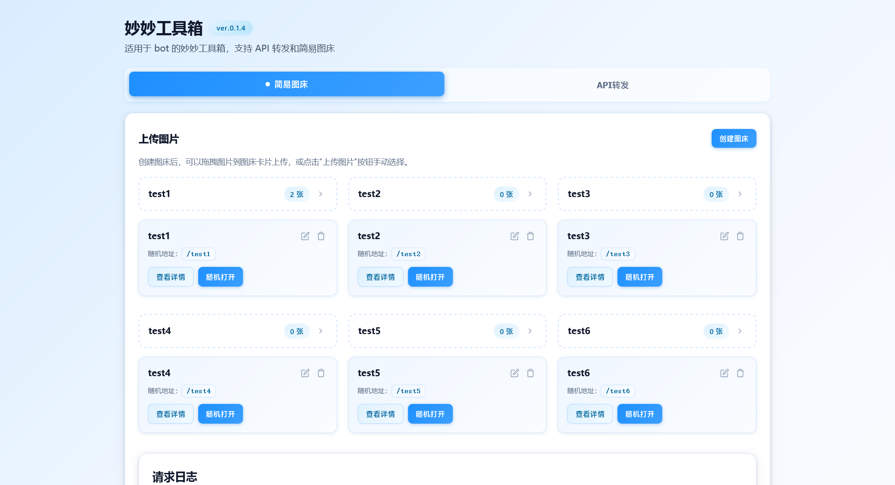
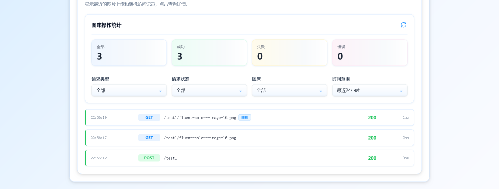

 # 简易图床 · 按图床随机展示

一个优雅的图床管理系统，支持多图床管理、随机图片展示、拖拽上传等功能。

## ✨ 特性

- 🎨 **现代化 UI**：简洁美观的用户界面
- 📦 **多图床管理**：创建、重命名、删除、排序图床
- 🚀 **拖拽上传**：支持拖拽和点击上传
- 🎲 **随机展示**：访问 `/:collection` 获取随机图片
- 📊 **请求日志**：详细的上传和访问记录
- 🔄 **自动刷新**：日志自动更新
- 💾 **本地存储**：所有图片存储在服务器本地

## 📸 界面预览

### 主界面



## 🏗️ 技术架构

### 后端
- **Express.js**：Web 框架
- **Multer**：文件上传中间件
- **Morgan**：HTTP 请求日志
- **模块化架构**：关注点分离，易于维护

### 前端
- **原生 JavaScript**：ES6+ 模块
- **函数式编程**：纯函数，减少副作用
- **类型注解**：JSDoc 提供智能提示
- **组件化**：可复用的 UI 组件

## 📁 项目结构

```
random-image-bed/
├── server/                 # 后端代码
│   ├── config.js          # 配置管理
│   ├── utils/             # 工具函数
│   ├── middleware/        # 中间件
│   └── routes/            # 路由模块
├── public/                # 前端代码
│   ├── assets/
│   │   ├── css/          # 样式文件
│   │   └── js/           # JavaScript 模块
│   │       ├── utils/    # 工具函数
│   │       ├── services/ # API 服务
│   │       ├── components/ # UI 组件
│   │       └── features/ # 功能模块
│   ├── uploads/          # 上传的图片
│   └── index.html        # 主页面
├── server.js             # 主入口
├── package.json          # 项目配置
└── README.md            # 项目说明
```

## 🚀 快速开始

### 安装依赖
```bash
npm install
```

### 启动服务器
```bash
npm start
```

服务器将在 `http://localhost:3000` 启动。

### 使用 Docker
```bash
docker-compose up -d
```

## 📖 API 文档

### 图床管理

#### 获取所有图床
```
GET /collections
```

#### 获取图床详情
```
GET /collections/:collection
```

#### 创建图床
```
POST /api/collections/:collection
```

#### 重命名图床
```
PUT /api/collections/:collection
Body: { "newName": "new-name" }
```

#### 删除图床
```
DELETE /api/collections/:collection
```

### 图片管理

#### 上传图片
```
POST /upload/:collection
Content-Type: multipart/form-data
Body: files (multiple files)
```

#### 删除图片
```
DELETE /api/images/:collection/:filename
```

#### 访问图片
```
GET /:collection/:filename
```

#### 随机图片
```
GET /:collection
```

### 日志管理

#### 获取日志列表
```
GET /api/logs?method=GET&status=success&collection=test&timeRange=24&limit=50
```

#### 获取日志详情
```
GET /api/logs/:id
```

#### 清空日志
```
DELETE /api/logs
```

## 🎯 使用示例

### 1. 创建图床
在首页点击"创建图床"按钮，输入图床名称。

### 2. 上传图片
- 拖拽图片到图床卡片
- 或点击"上传图片"按钮选择文件

### 3. 随机访问
```
访问 http://localhost:3000/your-collection
将随机返回该图床中的一张图片
```

### 4. 嵌入图片
```html

```

## 🔧 配置

编辑 `server/config.js` 修改配置：

```javascript
{
  PORT: 3000,              // 服务器端口
  MAX_FILE_SIZE: 10MB,     // 最大文件大小
  MAX_LOGS: 1000,          // 最大日志数量
  ALLOWED_TYPES: [...]     // 允许的文件类型
}
```

## 📊 代码质量

- ✅ **嵌套层级**: < 3 层
- ✅ **函数行数**: < 20 行平均
- ✅ **类型覆盖**: 90%+ JSDoc 注解
- ✅ **模块化**: 关注点分离
- ✅ **可维护性**: ⭐⭐⭐⭐⭐

详见 [CODE_QUALITY_REPORT.md](CODE_QUALITY_REPORT.md)

## 🔄 最近更新

### v2.0.0 (2025-10-19)
- 🎉 **重大重构**：代码模块化，提升可维护性
- ✨ 添加 JSDoc 类型注解
- ⚡ 优化代码结构，减少嵌套
- 🔧 应用函数式编程范式
- 📚 完善文档

详见 [REFACTORING.md](REFACTORING.md)

## 📝 许可证

MIT License

## 👨‍💻 贡献

欢迎提交 Issue 和 Pull Request！

## 📮 联系方式

如有问题，请提交 Issue。

---

**⭐ 如果这个项目对你有帮助，请给个星标！**
