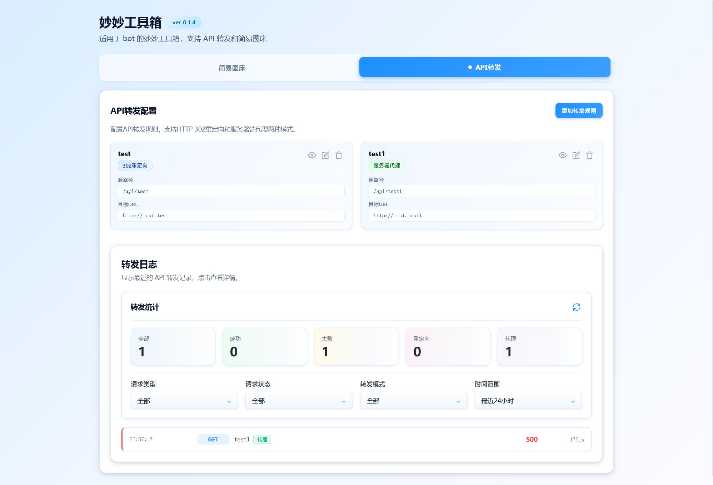

# 妙妙工具箱

一个优雅的多功能工具箱，集成简易图床和 API 转发功能。

## 🎯 功能模块

### 📸 简易图床
支持多图床管理、随机图片展示、拖拽上传等功能。

### 🔀 API 转发
灵活的 API 转发系统，支持重定向和代理两种模式，带有完整的日志记录。

## ✨ 特性

### 简易图床
- 🎨 **现代化 UI**：简洁美观的用户界面
- 📦 **多图床管理**：创建、重命名、删除、排序图床
- 🚀 **拖拽上传**：支持拖拽和点击上传
- 🎲 **随机展示**：访问 `/:collection` 获取随机图片
- 📊 **请求日志**：详细的上传和访问记录
- 🔄 **自动刷新**：日志自动更新
- 💾 **本地存储**：所有图片存储在服务器本地

### API 转发
- 🔀 **灵活转发**：支持 HTTP 302 重定向和服务器端代理两种模式
- 🎯 **规则管理**：可视化配置转发规则
- 📈 **转发日志**：独立的转发日志系统，记录每次转发详情
- 🔍 **多维筛选**：按请求类型、状态、转发模式、时间范围筛选日志
- ⚡ **高性能**：支持路径前缀匹配，灵活处理各种转发场景

## 📸 界面预览

### 简易图床


### API 转发


## 🏗️ 技术架构

### 后端
- **Express.js**：Web 框架
- **Multer**：文件上传中间件
- **Morgan**：HTTP 请求日志
- **模块化架构**：关注点分离，易于维护

### 前端
- **原生 JavaScript**：ES6+ 模块
- **函数式编程**：纯函数，减少副作用
- **类型注解**：JSDoc 提供智能提示
- **组件化**：可复用的 UI 组件

## 📁 项目结构

```
random-image-bed/
├── server/                 # 后端代码
│   ├── config.js          # 配置管理
│   ├── utils/             # 工具函数
│   ├── middleware/        # 中间件
│   └── routes/            # 路由模块
├── public/                # 前端代码
│   ├── assets/
│   │   ├── css/          # 样式文件
│   │   └── js/           # JavaScript 模块
│   │       ├── utils/    # 工具函数
│   │       ├── services/ # API 服务
│   │       ├── components/ # UI 组件
│   │       └── features/ # 功能模块
│   ├── uploads/          # 上传的图片
│   └── index.html        # 主页面
├── server.js             # 主入口
├── package.json          # 项目配置
└── README.md            # 项目说明
```

## 🚀 快速开始

### 安装依赖
```bash
npm install
```

### 启动服务器
```bash
npm start
```

服务器将在 `http://localhost:3000` 启动。

### 使用 Docker

**首次部署**，需要先创建转发规则文件：
```bash
# 创建转发规则文件
echo '{"rules":[]}' > forward-rules.json

# 启动容器
docker-compose up -d
```

**已有配置**时，直接启动：
```bash
docker-compose up -d
```

**持久化说明**：
- `./uploads` → 图片存储目录
- `./forward-rules.json` → 转发规则配置文件

这两个路径会自动持久化到宿主机，容器重启不会丢失数据。

**文件权限说明**：
- 容器使用 `nobody:nogroup (99:100)` 用户运行，提升安全性
- 所有文件权限设置为 `775`，确保宿主机可以正常读写持久化文件
- 无需手动调整文件权限即可在宿主机上访问和修改配置文件

## 📖 API 文档

### API 转发管理

#### 获取所有转发规则
```
GET /api/forward/rules
```

#### 添加转发规则
```
POST /api/forward/rules
Content-Type: application/json
Body: {
  "name": "规则名称",
  "mode": "redirect",  // redirect | proxy
  "source": "/api/endpoint",
  "target": "https://target-api.example.com/data"
}
```

#### 更新转发规则
```
PUT /api/forward/rules/:id
Content-Type: application/json
Body: {
  "name": "新规则名称",
  "mode": "proxy",
  "source": "/api/endpoint",
  "target": "https://new-target.example.com/data"
}
```

#### 删除转发规则
```
DELETE /api/forward/rules/:id
```

#### 获取转发日志
```
GET /api/forward/logs?method=GET&status=success&mode=redirect&timeRange=24&limit=50
```

#### 获取转发日志详情
```
GET /api/forward/logs/:id
```

#### 清空转发日志
```
DELETE /api/forward/logs
```

### 图床管理

#### 获取所有图床
```
GET /collections
```

#### 获取图床详情
```
GET /collections/:collection
```

#### 创建图床
```
POST /api/collections/:collection
```

#### 重命名图床
```
PUT /api/collections/:collection
Body: { "newName": "new-name" }
```

#### 删除图床
```
DELETE /api/collections/:collection
```

### 图片管理

#### 上传图片
```
POST /upload/:collection
Content-Type: multipart/form-data
Body: files (multiple files)
```

#### 删除图片
```
DELETE /api/images/:collection/:filename
```

#### 访问图片
```
GET /:collection/:filename
```

#### 随机图片
```
GET /:collection
```

### 日志管理

#### 获取日志列表
```
GET /api/logs?method=GET&status=success&collection=test&timeRange=24&limit=50
```

#### 获取日志详情
```
GET /api/logs/:id
```

#### 清空日志
```
DELETE /api/logs
```

## 🎯 使用示例

### 简易图床

#### 1. 创建图床
在首页点击"创建图床"按钮，输入图床名称。

#### 2. 上传图片
- 拖拽图片到图床卡片
- 或点击"上传图片"按钮选择文件

#### 3. 随机访问
```
访问 http://localhost:3000/your-collection
将随机返回该图床中的一张图片
```

#### 4. 嵌入图片
```html

```

### API 转发

#### 1. 创建转发规则
切换到"API转发"标签页，点击"添加转发规则"：
- **名称**：为规则起一个描述性名称
- **转发模式**：
  - `HTTP 302 重定向`：客户端直接访问目标 URL
  - `服务器端代理`：服务器代理请求，隐藏目标 URL
- **API端点**：本地路径（如 `/users`）
- **目标服务器**：实际的 API 地址（如 `https://api.example.com/v1/users`）

#### 2. 使用转发
配置后，访问：
```
http://localhost:3000/api/users
```
将自动转发到：
```
https://api.example.com/v1/users
```

#### 3. 查看转发日志
在"转发日志"区域可以看到：
- 转发统计（总数、成功、失败、重定向、代理）
- 详细的转发记录
- 支持多维度筛选

## 🔧 配置

编辑 `server/config.js` 修改配置：

```javascript
{
  PORT: 3000,              // 服务器端口
  MAX_FILE_SIZE: 10MB,     // 最大文件大小
  MAX_LOGS: 1000,          // 最大日志数量（包括图床日志和转发日志）
  ALLOWED_TYPES: [...]     // 允许的文件类型
}
```

转发规则存储在项目根目录的 `forward-rules.json` 文件中。

**Docker 部署注意事项**：
- 转发规则文件需要单独挂载以实现持久化
- 建议在首次部署前创建空的规则文件：`echo '{"rules":[]}' > forward-rules.json`
- 图床顺序配置自动存储在 `uploads/.collections-order.json`（已通过 uploads 目录持久化）

## 🔄 最近更新

### ver.0.1.4
- 🔀 **新功能**：添加 API 转发功能
- 📊 **转发日志**：独立的转发日志系统
- 🎨 **UI 优化**：优化统计卡片样式
- 📈 **日志筛选**：支持多维度日志筛选

### ver.0.1.3
- 🎉 **重大重构**：代码模块化，提升可维护性
- ✨ 添加 JSDoc 类型注解
- ⚡ 优化代码结构，减少嵌套
- 🔧 应用函数式编程范式
- 📚 完善文档

## 📝 许可证

MIT License

## 👨‍💻 贡献

欢迎提交 Issue 和 Pull Request！

## 📮 联系方式

如有问题，请提交 Issue。

---

**⭐ 如果这个项目对你有帮助，请给个星标！**
